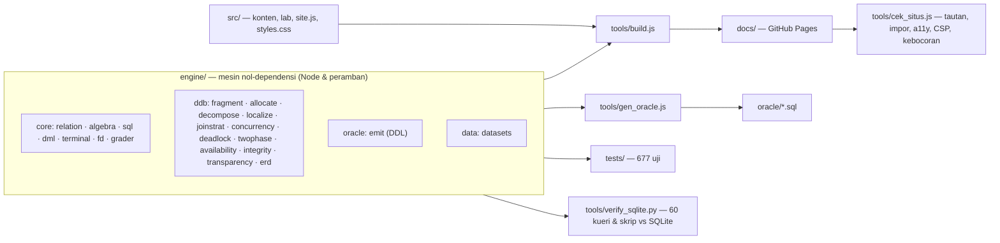

# ORACLEDECK

**Laboratorium Sistem Basis Data Terdistribusi (CTI313, Universitas Esa Unggul).**
Empat belas topik kuliah, enam belas laboratorium interaktif, Terminal SQL gaya SQL\*Plus
dengan tiga situs lewat database link, dan bank soal praktikum yang dinilai otomatis.
Mesin relasionalnya ditulis dari nol, hasilnya diverifikasi silang terhadap SQLite, dan
rancangannya diterjemahkan menjadi DDL Oracle.

[](https://github.com/xyb3rpunq/oracledeck/actions/workflows/verifikasi.yml)
[](https://github.com/xyb3rpunq/oracledeck/actions/workflows/oracle.yml)

| | |
|---|---|
| **Situs** | https://xyb3rpunq.github.io/oracledeck |
| **Terminal SQL** | https://xyb3rpunq.github.io/oracledeck/lab/sql.html |
| **Versi** | 2.1.0 — lihat [CHANGELOG.md](CHANGELOG.md) |
| **Oracle sungguhan** | Oracle AI Database 26ai Free Release 23.26.3.0.0: 21/21 skrip lulus, 60 pemeriksaan mandiri LULUS — [HASIL_UJI.md](oracle/HASIL_UJI.md) |
| **Lisensi** | MIT |

Statis, nol dependensi runtime, tanpa server, tanpa pelacak, bisa dibuka luring. Seluruh
perhitungan berjalan di peramban pengunjung; tidak ada data yang dikirim ke mana pun.

---

## Daftar isi

1. [Untuk siapa](#untuk-siapa)
2. [Fitur utama](#fitur-utama)
3. [Terminal SQL Live](#terminal-sql-live)
4. [Laboratorium](#laboratorium)
5. [Arsitektur](#arsitektur)
6. [Menjalankan secara lokal](#menjalankan-secara-lokal)
7. [Verifikasi dan jaminan mutu](#verifikasi-dan-jaminan-mutu)
8. [Struktur repositori](#struktur-repositori)
9. [Batas yang jujur](#batas-yang-jujur)
10. [Kontribusi, keamanan, lisensi](#kontribusi-keamanan-lisensi)

---

## Untuk siapa

- **Mahasiswa CTI313** yang ingin melihat konsep basis data terdistribusi *berjalan*: fragmen
  dipecah, kueri dilokalisasi, 2PC memblokir, deadlock terdeteksi — dengan data sungguhan.
- **Pengajar** yang butuh peraga kelas dan bank soal yang menilai hasil, bukan teks jawaban.
- **Siapa pun yang belajar Oracle** dan ingin mencoba DDL, transaksi, database link, dan
  `DBA_2PC_PENDING` tanpa memasang Oracle.

## Fitur utama

| Fitur | Keterangan |
|---|---|
| **Terminal SQL Live** | SELECT, DML, DDL, transaksi, kamus data, `EXPLAIN PLAN`, tiga situs lewat `tabel@situs`; pratinjau hasil muncul saat mengetik |
| **Tombol ▶ Jalankan di mana-mana** | Setiap blok SQL yang benar-benar bisa dieksekusi — di materi maupun keluaran lab — membuka laci terminal di halaman yang sama |
| **31 kueri "Coba di terminal"** | Minimal dua per topik, memperagakan konsep topiknya (termasuk kegagalan yang disengaja) |
| **Catatan istilah** | 102 istilah glosarium dengan arti, rincian, contoh, dan tautan lab; muncul saat istilah di materi disorot atau difokus keyboard |
| **Bank soal 38 butir** | Praktikum 2–5, termasuk 6 soal INSERT/UPDATE/DELETE ber-CASCADE yang dinilai dari keadaan tabel; dinilai langsung saat mengetik |
| **16 laboratorium** | Algoritma sungguhan; lab berbasis teks menghitung ulang saat masukan berubah |
| **Pencarian Ctrl+K** | Materi, subtopik, lab, istilah, contoh SQL, soal, dan skrip Oracle |
| **Kemajuan belajar** | Halaman yang sudah dibuka ditandai; beranda menunjukkan langkah berikutnya |
| **Tema terang/gelap, PWA luring** | Pilihan tema disimpan; service worker berversi untuk akses tanpa jaringan |
| **21 skrip Oracle teruji** | Tiga PDB + database link, `PARTITION BY LIST/REFERENCE`, materialized view, 2PC, transaksi ragu-ragu + `COMMIT FORCE` — dijalankan otomatis di Oracle sungguhan |

## Terminal SQL Live

Terminal adalah sesi basis data pribadi di peramban. Autocommit **mati** seperti Oracle:
perubahan tertunda sampai `COMMIT`, dan `\reset` selalu mengembalikan data awal.

### Preset basis data

| Preset | Isi |
|---|---|
| `rumahsakit` | Enam tabel Praktikum 2; FK ON DELETE/UPDATE CASCADE sesuai lembar praktikum; CHECK jenis kelamin |
| `akademik` | `mhs`, `mata_kuliah` (+ view `matakuliah`), `nilai` dengan CHECK 0–100 — Praktikum 3–5 |
| `terdistribusi` | 18 fragmen `tabel@jakarta/bandung/surabaya` + 6 view global UNION ALL |
| `dreamhome` | STAFF, BRANCH, PROPERTY dari Modul 6 dan 7 |
| `kependudukan` | Tiga desa studi kasus skripsi, NIK fiktif bersegmen 9999 |
| `kosong` | Tanpa tabel — rancang skema sendiri |

### Contoh sesi terdistribusi

```sql
SELECT kota, COUNT(*) FROM pasien GROUP BY kota;      -- view global: transparansi lokasi
SELECT * FROM pasien@bandung;                          -- fragmen lewat database link
INSERT INTO pasien@bandung (id_pasien, nama_pasien, jenis_kelamin, kota)
VALUES (20, 'Salah situs', 'L', 'Jakarta');            -- ORA-02290: CHECK predikat fragmen
UPDATE pasien@jakarta  SET penyakit = 'Sembuh' WHERE id_pasien = 1;
UPDATE pasien@surabaya SET penyakit = 'Sembuh' WHERE id_pasien = 5;
COMMIT;                                                -- two-phase commit, jejak PREPARE/VOTE ditampilkan
\gagal koordinator                                     -- transaksi berikutnya jadi in-doubt
SELECT * FROM dba_2pc_pending;                         -- lalu COMMIT FORCE '<id>'
```

### Yang didukung

| Kelompok | Sintaks |
|---|---|
| Kueri | `SELECT [DISTINCT]`, `CASE`, `WITH`, subquery pada FROM/IN/EXISTS/skalar (boleh berkorelasi), `UNION [ALL]`, `INTERSECT`, `MINUS`, `FETCH FIRST n ROWS ONLY`, `DUAL` |
| DML | `INSERT ... VALUES` (banyak baris) / `INSERT ... SELECT`, `UPDATE`, `DELETE` |
| Kendala | PRIMARY KEY, FOREIGN KEY (CASCADE / SET NULL / RESTRICT), UNIQUE, CHECK, NOT NULL, DEFAULT, tipe dan panjang `NUMBER(p,s)` / `VARCHAR2(n)` / `DATE` |
| DDL | `CREATE TABLE [AS SELECT]`, `CREATE [OR REPLACE] VIEW`, `CREATE [UNIQUE] INDEX`, `DROP ... [CASCADE CONSTRAINTS]`, `TRUNCATE` |
| Transaksi | `COMMIT`, `ROLLBACK`, `SAVEPOINT`, `ROLLBACK TO`, commit implisit oleh DDL, `COMMIT FORCE` / `ROLLBACK FORCE` |
| Oracle | `DESC`, `EXPLAIN PLAN FOR` (operator `REMOTE`), kamus data `user_tables`, `user_views`, `user_tab_columns`, `user_constraints`, `user_indexes`, `dba_2pc_pending`, kode galat ORA-xxxxx |
| Meta | `\d`, `\d nama`, `\db`, `\c situs`, `\kunci`, `\gagal`, `\status`, `\ekspor`, `\reset`, `\clear`, `\?` |

Galat disertai petunjuk dan saran "maksud Anda …?" untuk nama yang salah ketik. `\ekspor`
menghasilkan skrip Oracle (CREATE TABLE + kendala + INSERT + view) dari keadaan sesi.

## Laboratorium

| # | Lab | Yang dijalankan |
|---|---|---|
| 01 | Perancang ERD | ERD → skema relasional → DDL Oracle (1:1, 1:N, N:M, multinilai, entitas lemah) |
| 02 | Normalisasi 1NF–BCNF | Penutupan atribut, candidate key, minimal cover, sintesis 3NF, uji chase lossless-join |
| 03 | Terminal SQL Live | Sesi SQL lengkap, tiga situs, 2PC saat COMMIT |
| 04 | Perancang Fragmentasi | Horizontal, vertikal, turunan, campuran + audit tiga aturan kebenaran |
| 05 | Alokasi & Replikasi | Model biaya empat kelompok informasi, alokasi optimal, ketersediaan |
| 06 | Dekomposisi Kueri | CNF/DNF, graf kueri, eliminasi redundansi, pohon operator untuk WITH/UNION/INTERSECT/MINUS |
| 07 | Lokalisasi Data | Program lokalisasi dan reduksi, diverifikasi setara dengan kueri global |
| 08 | Tangga Transparansi | Satu kueri pada lima tingkat transparansi, DRDA, penamaan System R\* |
| 09 | Join Terdistribusi | Kirim utuh, semijoin, bloom join, titik impas |
| 10 | Kendali Konkurensi | Graf presedensi, 2PL, timestamp ordering, recoverable/cascadeless/strict |
| 11 | Manajemen Deadlock | Deteksi terpusat, path pushing, edge chasing, deadlock semu, wait-die/wound-wait |
| 12 | Simulator 2PC & 3PC | Injeksi kegagalan koordinator, peserta, partisi, dan peserta di balik gateway ODBC |
| 13 | Ketersediaan & CAP | MTBF/MTTR, kuorum R+W>N, CAP, PACELC, RTO/RPO |
| 14 | Generator DDL Oracle | Rancangan terdistribusi → objek Oracle |
| 15 | Bank Soal Praktikum | 38 soal, termasuk DML ber-CASCADE, dinilai saat mengetik |
| 16 | Studi Kasus Kependudukan | Oracle XE + MySQL lewat ODBC: NIK ganda yang lolos UNIQUE lokal |

## Arsitektur



Prinsip rancangan:

1. **Satu mesin, dua lingkungan.** Berkas JavaScript yang sama diuji di Node dan dijalankan
   di peramban — tidak ada salinan logika untuk situs.
2. **Semua dibangkitkan.** `docs/` dan `oracle/` adalah keluaran generator; CI menolak
   keluaran yang berbeda dari hasil generator.
3. **Tanpa janji kosong.** Tombol ▶ Jalankan hanya dipasang pada SQL yang terbukti berjalan;
   contoh dan kueri per topik diuji berjalan persis seperti yang dijanjikan.
4. **Berversi isi.** Setiap impor dan aset diberi `?v=<sidik isi>` agar peramban tidak
   memasangkan halaman baru dengan mesin lama.

## Menjalankan secara lokal

Prasyarat: Node.js ≥ 18, Python ≥ 3.10 (hanya untuk verifikasi SQLite).

```bash
git clone https://github.com/xyb3rpunq/oracledeck.git
```

```bash
npm run all
```

```bash
python -m http.server 8765 --directory docs
```

Lalu buka `http://localhost:8765`. Perintah terpisah:

| Perintah | Fungsi |
|---|---|
| `npm test` | Seluruh uji otomatis |
| `npm run verify` | Verifikasi silang terhadap SQLite |
| `npm run oracle` | Bangkitkan ulang `oracle/*.sql` |
| `npm run oracle:uji` | Jalankan semua skrip di Oracle Free lewat Docker |
| `npm run oracle:verifikasi` | Bandingkan mesin terminal dengan Oracle Free |
| `npm run build` | Bangun situs ke `docs/` |
| `npm run cek` | Periksa keluaran situs |

## Terbukti di Oracle sungguhan

Semua skrip `oracle/` dijalankan otomatis oleh `node tools/uji_oracle.mjs` pada container
`gvenzl/oracle-free:23-slim` (Oracle AI Database 26ai Free Release 23.26.3.0.0) dengan tiga situs sebagai tiga
pluggable database yang terhubung database link:

| Pemeriksaan | Hasil |
|---|---|
| Skrip Oracle (tiap skrip memeriksa hasilnya sendiri dengan baris LULUS/GAGAL) | 21/21 skrip lulus, 60 pemeriksaan mandiri LULUS |
| Mesin terminal vs Oracle (`node tools/verifikasi_oracle.mjs`) | kueri 53/53, DML 7/7, kode galat 39/39, ekspor 4/4 |

Menjalankannya di Oracle mengungkap hal yang tidak mungkin terlihat dari uji pembangkit saja:
`PARTITION BY REFERENCE` butuh `ENABLE ROW MOVEMENT` bila induknya memakainya (ORA-14661),
catatan `DBA_2PC_PENDING` ditulis asinkron, kueri lewat database link membuka transaksi yang
harus diakhiri sebelum `COMMIT FORCE` (ORA-02043), dan Oracle memeriksa nama kolom saat parse
sehingga galatnya muncul walau tabel kosong. Seluruhnya sudah diperbaiki; mesin terminal kini
meniru perilaku yang terbukti. Log SQL*Plus lengkap ada di `oracle/bukti/`.

```bash
node tools/uji_oracle.mjs
```

```bash
node tools/verifikasi_oracle.mjs
```

## Verifikasi dan jaminan mutu

| Langkah | Perintah | Yang dibuktikan |
|---|---|---|
| 1 | `node tests/run.js` | 688 uji: mesin SQL & DML, terminal, algoritma terdistribusi, penilai, pembantu build, aksesibilitas statis, anggaran kinerja |
| 2 | `python tools/verify_sqlite.py` | 53 kueri dan 7 skrip DML menghasilkan isi identik di mesin ini dan SQLite |
| 3 | `node tools/gen_oracle.js` | Skrip Oracle dihasilkan ulang dari mesin yang sama |
| 4 | `node tools/build.js` | Situs dibangun ulang secara deterministik |
| 5 | `node tools/cek_situs.js` | Tautan, impor modul, sitemap, judul unik, CSP, satu `<h1>`, landmark, urutan judul, label, kebocoran surel/telepon |

GitHub Actions menjalankan kelima langkah pada setiap push dan menolak `docs/` atau `oracle/`
yang basi. Workflow terpisah `oracle.yml` menjalankan seluruh skrip dan verifikasi mesin pada
Oracle Free setiap kali mesin atau skrip Oracle berubah. Pemetaan ke sembilan karakteristik **ISO/IEC 25010:2023** dan target **WCAG 2.2 AA**
beserta buktinya ada di halaman [Standar Kualitas](https://xyb3rpunq.github.io/oracledeck/kualitas.html).
Proyek ini *mengacu* pada standar tersebut; ia tidak disertifikasi.

## Struktur repositori

```
engine/            mesin: relasional, SQL, DML, terminal, algoritma terdistribusi, DDL Oracle
src/content/       materi 14 topik, contoh SQL, kueri per topik, bank soal, glosarium
src/labs/          16 lab + antarmuka terminal
src/site.js        tema, pencarian, laci terminal, catatan istilah, kemajuan, service worker
tools/             build, generator & runner Oracle, pemeriksa situs, verifikasi SQLite dan Oracle
tests/             uji Node tanpa kerangka pihak ketiga
oracle/            21 skrip Oracle, HASIL_UJI.md, VERIFIKASI_MESIN.md, log bukti SQL*Plus
docs/              situs hasil build (GitHub Pages)
AUDIT.md           audit materi, proyek terdahulu, dan proyek ini sendiri
```

## Batas yang jujur

- **Tiga situs diuji di satu container**, bukan tiga server di jaringan sungguhan: latensi dan
  kegagalan jaringan tidak ikut teruji. Kegagalan 2PC disimulasikan dengan fasilitas resmi Oracle
  `ORA-2PC-CRASH-TEST-n`.
- **Terminal bukan Oracle.** Belum ada window function, `MERGE`, `ALTER TABLE`, PL/SQL,
  sequence, dan trigger. Rencana eksekusi mengikuti evaluasi logis mesin ini, bukan
  pengoptimal biaya Oracle. Pesan galat ditulis ulang dalam bahasa Indonesia; kode galat dijamin
  sama dengan Oracle untuk kasus yang terdaftar di `src/content/kasus-galat-oracle.js`.
- **Model biaya lab adalah model**, bukan pengukuran jaringan sungguhan.
- **Data contoh adalah data karangan.** Tidak ada data pribadi nyata di repositori ini.

## Kontribusi, keamanan, lisensi

- Laporan bug dan saran: GitHub Issues. Setiap perubahan wajib lulus `npm run all`.
- Celah keamanan: lihat [SECURITY.md](SECURITY.md).
- Riwayat versi: [CHANGELOG.md](CHANGELOG.md).
- Lisensi: [MIT](LICENSE).

Disusun oleh Daniel Hutajulu (20210801207) untuk CTI313 Sistem Basis Data Terdistribusi,
Universitas Esa Unggul. Tidak berafiliasi dengan Oracle Corporation; nama Oracle dipakai
hanya sebagai rujukan teknis.
